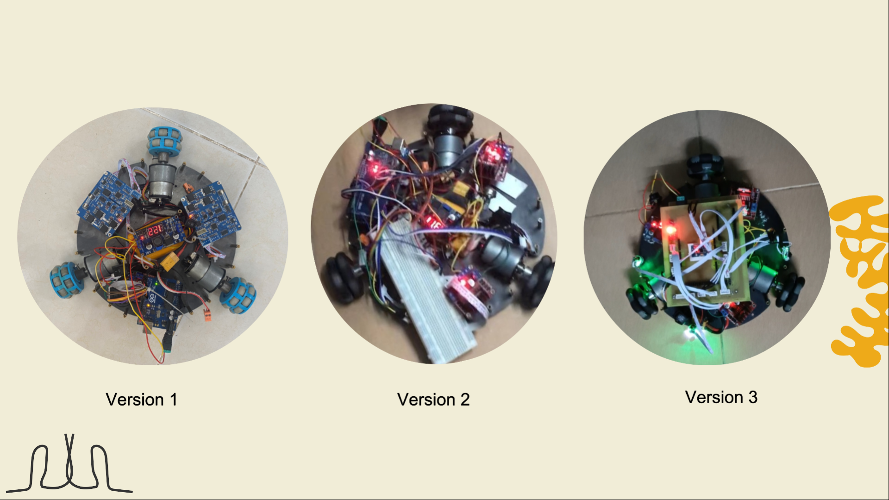

<h1 align="center">Robot Omni 3 Wheels RTOS</h1>

# Project Title

Vectoring code for a three wheel omni chassis written for Arduino Microcontroller.   

## DC Motor Speed Control
Motor speed control using encoders. Encoder are connected to the hardware interrupt of the microcontroller(Arduino Mega). A timer using the timming interrupt service routine is used to measure the motor rotation speed. System Identification is performed to approximate the DC motors as 2nd order system. PID controller is implemented for speed control. 

## Vectoring
X and Y vector (or Magnitude, Theta) are transformed to the three motor RPMs.

## High Level Control
### 1. Control via ESP8266 blynk app: 
This functionality is added for the control of robot via ROS running your smart phone.

## Video demo
[Video Demo](https://www.youtube.com/watch?v=WiIC_UjOM_0) 

Contact us if you have any problem

## Authors

Contributors names and contact info

* [Phan Ben](https://www.facebook.com/benphan110) - Da Nang University of Technology - Email: phanben110@gmail.com
* [Dương Hoang Thanh Trúc](https://www.facebook.com/yul.duonqq) - Da Nang University of Technology
* [Nguyễn Hải Đức](https://www.facebook.com/duc.nguyenhai741) - Da Nang University of Technology
* [Phạm Thành Long](https://www.facebook.com/mrlong2k) - Da Nang University of Technology
* [Nguyễn Quốc Nhân](https://www.facebook.com/profile.php?id=100007475868554) - Da Nang University of Technology

## Acknowledgments

* [Tuning a PID Controller with Genetic Algorithms](https://www.youtube.com/watch?v=S5C_z1nVaSg&t=2s)
* [PID Speed and PID position](http://arduino.vn/result/5401-pid-speed-position-control)
